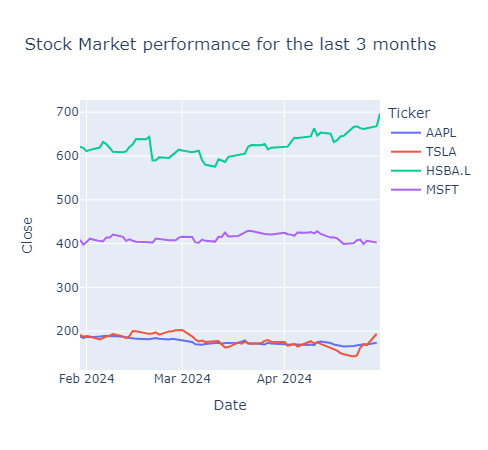
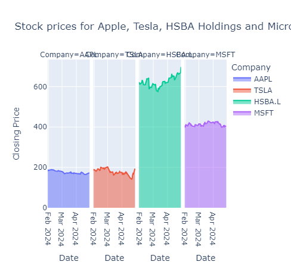
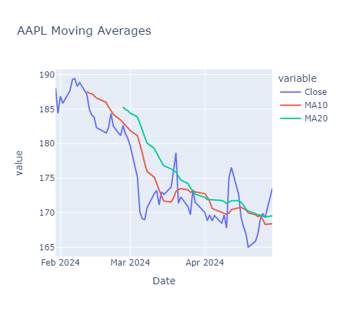
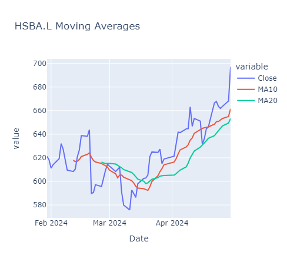
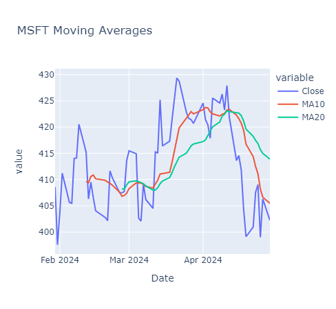
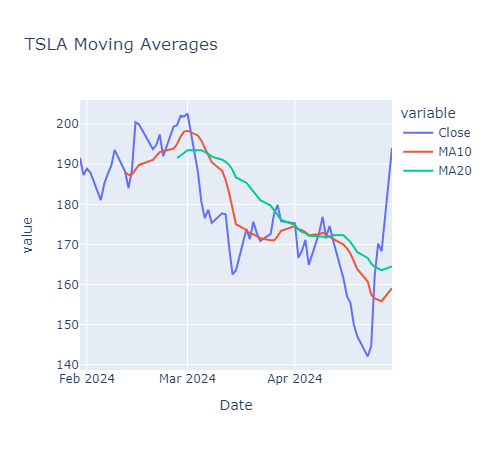
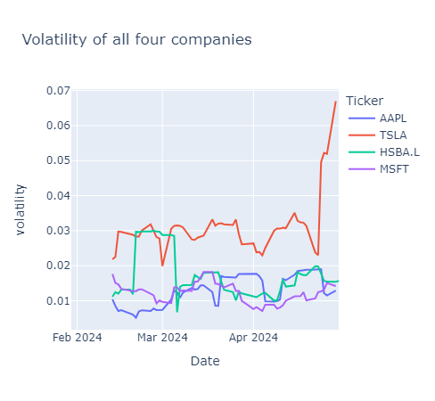
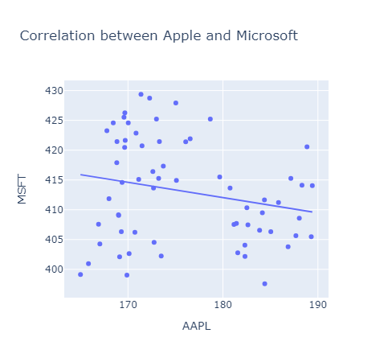

# STOCK PERFORMANCE ANALYSIS

 I am conducting a stock performance analysis of four companies:
**Tesla.Inc**, **Apple**,  **Microsoft** and **HSBC.L holdings**.
NB: This is just for the demonstration purposes but the data are real dataset.

## Tools used

**Visual studio code** with jupiter notebook extension.

## Analysis

Import relevant packages

```py
import pandas as pd
import yfinance as yf 
from datetime import datetime
```

The next step is to download the historical stock prices dataset of the four companies from yfinance.

Specify the start and end date of our monitoring period: (3 months)

Here's the codes

```py
start_date = datetime.now() - pd.DateOffset(months= 3)
end_date = datetime.now()

tickers = ['AAPL', 'TSLA', 'HSBA.L', 'MSFT']

df_list= []

for ticker in tickers:
    data = yf.download (ticker, start= start_date, end= end_date)
    df_list.append(data)

df= pd.concat(df_list, keys=tickers, names= ['Ticker', 'Date'])
print(df.head())
```

 In the downloaded historical price dataset, the Date column is the index column in the DataFrame, therefore we need to reset the index before moving forward with our analysis.

```py
df = df.reset_index()
print(df.head())
```

Then after resetting the index we then investigate the performance of these companies in the stock market.
Here's the codes

```py
import plotly.express as px 
fig = px.line (df, x= 'Date',
               y= 'Close',
               color = 'Ticker',
               title= "Stock Market performance for the last 3 months")
fig.show()
```

Here's the result



To make it easy to understand and compare the performance of these companies and identify similarities or differences in their stock price movement,let's look at the facet area chart.

```py
fig = px.area(df, x = 'Date', y = 'Close', color = 'Ticker',
              facet_col='Ticker',
              labels= {'Date':'Date', 'Close':'Closing Price', 'Ticker':'Company'},
              title = 'Stock prices for Apple, Tesla, HSBA Holdings and Microsoft')
fig.show()
```

Here's the result



Apple (AAPL): Apple's stock remains stable but is situated below the $200 mark. It hasn’t seen as much fluctuation as HSBA or Tesla.

Tesla (TSLA): Tesla’s stock price starts around $180s and gradually fluctuates and increases to just above $200. This suggests a positive trend for Tesla’s stock during the given period.

HSBA Holdings (HSBA.L):  HSBA.L’s stock price begins at slightly at $600 and then rises sharply to $700. Tesla’s stock has experienced significant growth during this time frame.

Microsoft (MSFT): Unlike the other companies, HSBA.L’s stock remains relatively stable around the $400 mark. This indicates less volatility compared to HSBA and Tesla.

## Trends (Moving Averages)

The next step is to identify trends and patterns in each company’s stock price movements over a period of time.
To do so, the best way is to analyze the moving average (MA) and specify the number of days for these average(the window period).

Here's the code

```py
df['MA10'] = df.groupby('Ticker')['Close'].rolling(window=10).mean().reset_index(0, drop=True)
df['MA20'] = df.groupby('Ticker')['Close'].rolling(window=20).mean().reset_index(0, drop=True)

for ticker, group in df.groupby('Ticker'):
    print(f'Moving Average for {ticker}')
    print(group[['MA10', 'MA20']])
```

Results are on the ipynb file

Let's visualize the moving averages of all companies:

```py
for ticker, group in df.groupby('Ticker'):
    fig = px.line(group, x= 'Date', y=['Close', 'MA10', 'MA20'],
                  title= f"{ticker} Moving Averages")
    fig.show()
```






Just an explanation of the last graph Tesla:

**Closing Prices (Blue Line)**: TSLA (Tesla.Inc)
The blue line represents the actual closing prices of TSLA stock over time. When the blue line goes up, it means the stock price increased on that day, and vice versa.
The overall trend appears to be upward, especially after early April.

**MA10 (Red Line)**: The red line represents the 10-day moving average (MA10). MA10 is calculated by averaging the closing prices over the past 10 trading days.
When the red line crosses above the blue line, it suggests a potential bullish signal. Around early April, the red line crosses above the blue line, indicating a positive trend.

**MA20 (Green Line)**: The green line represents the 20-day moving average (MA20). MA20 considers the average closing prices over the past 20 trading days. When the green line crosses above the red line, it confirms a bullish sentiment. Similarly, around early April, the green line crosses above the red line, supporting the positive trend.

***In summary***

The stock price has been generally rising.
Both MA10 and MA20 confirm the bullish trend after early April.

The output shows four separate graphs for each company. When the MA10 crosses above the MA20, it is considered a bullish signal indicating that the stock price will continue to rise.
Conversely, when the MA10 crosses below the MA20, it is a bearish signal that the stock price will continue falling.

## Volatility

Volatility is a measure of how much and how often the stock prices or market fluctuates over a given period of time.

High volatility indicates that the stock or market experiences large and frequent price movements,
while low volatility indicates that the market experiences smaller or less frequent price movements.
 Here's the volatility of all four companies:

```py
df['volatility'] = df.groupby('Ticker')['Close'].pct_change().rolling(window=10).std().reset_index(0, drop=True)
fig = px.line(df, x='Date', y= 'volatility',
              color = 'Ticker',
              title="Volatility of all four companies")
fig.show()
```

Result breakdown

Volatility Trends:

TSLA: The volatility of Tesla appears to be the highest among the four companies, especially in April 2024.

HSBA.L and MSFT: Their volatility remain relatively stable with slight fluctuations.
AAPL: Apple has the lowest volatility among all four companies throughout this period.



## Correlation

 Now lets analyze the correlation between companies: Apple and Microsoft stock prices

```py
Apple = df.loc[df['Ticker']== 'AAPL', ['Date', 'Close']].rename(columns= {'Close': 'AAPL'})
Microsoft = df.loc[df['Ticker']== 'MSFT', ['Date', 'Close']].rename(columns= {'Close': 'MSFT'})
df_corr = pd.merge(Apple, Microsoft, on='Date')
```

 ***Create a scatter plot to visualize the correlation***

 ```py
fig = px.scatter(df_corr, x='AAPL', y='MSFT',
                 trendline='ols',
                 title='Correlation between Apple and Microsoft')
fig.show()
```

 Here's the result breakdown



For the past three months from February to April there has been a negative correlation between Microsoft and Apple.inc.

The downward-sloping trend line suggests a negative correlation. When AAPL stock price increases, MSFT stock price tends to decrease (and vice versa).
The strength of this relationship is not extreme, but it’s noticeable

## Conclusion

Stock performance analysis is so essential for businesses, investors and trading companies. This project just analyzed the four companies and there's possibility of analyzing companies of your choice and the period.
